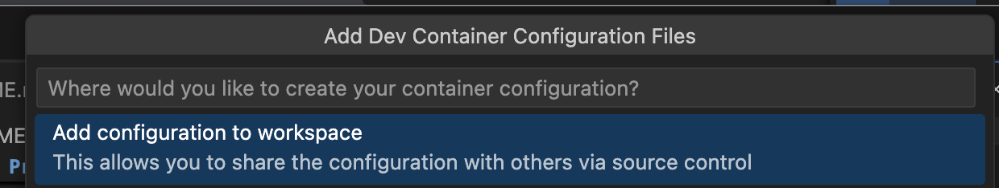
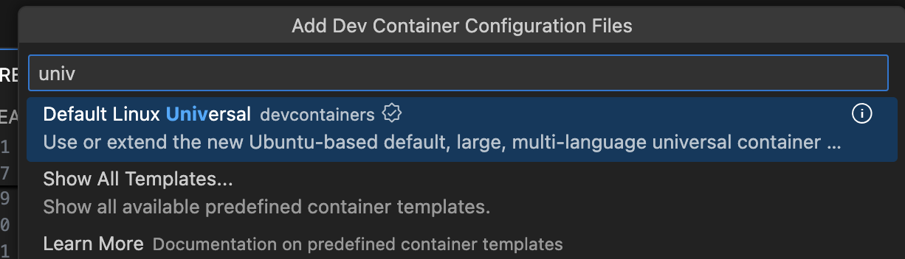
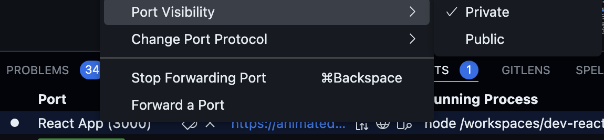
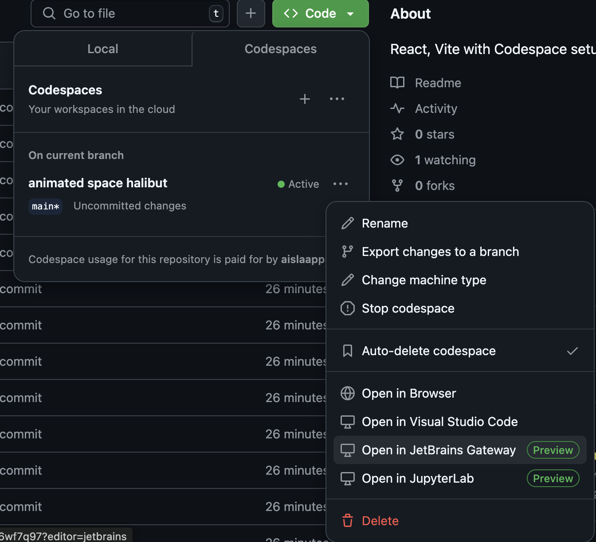

# React + TypeScript + Vite
### Author: aislaapps

This template provides a minimal setup to get React working in Vite with HMR and some ESLint rules.

Currently, two official plugins are available:

- [@vitejs/plugin-react](https://github.com/vitejs/vite-plugin-react/blob/main/packages/plugin-react/README.md) uses [Babel](https://babeljs.io/) for Fast Refresh
- [@vitejs/plugin-react-swc](https://github.com/vitejs/vite-plugin-react-swc) uses [SWC](https://swc.rs/) for Fast Refresh

## Expanding the ESLint configuration

If you are developing a production application, we recommend updating the configuration to enable type aware lint rules:

- Configure the top-level `parserOptions` property like this:

```js
export default tseslint.config({
  languageOptions: {
    // other options...
    parserOptions: {
      project: ['./tsconfig.node.json', './tsconfig.app.json'],
      tsconfigRootDir: import.meta.dirname,
    },
  },
})
```

- Replace `tseslint.configs.recommended` to `tseslint.configs.recommendedTypeChecked` or `tseslint.configs.strictTypeChecked`
- Optionally add `...tseslint.configs.stylisticTypeChecked`
- Install [eslint-plugin-react](https://github.com/jsx-eslint/eslint-plugin-react) and update the config:

```js
// eslint.config.js
import react from 'eslint-plugin-react'

export default tseslint.config({
  // Set the react version
  settings: { react: { version: '18.3' } },
  plugins: {
    // Add the react plugin
    react,
  },
  rules: {
    // other rules...
    // Enable its recommended rules
    ...react.configs.recommended.rules,
    ...react.configs['jsx-runtime'].rules,
  },
})
```
# Project Creation

## Create project

npm 6.x version
```
npm create vite@latest dev-react-vite-app --template react-ts
```

npm 7+ version
```
npm create vite@latest dev-react-vite-app -- --template react-ts
```

yarn
```
yarn create vite devc-react-app --template react-ts
```

## Install

```
cd dev-react-vite-app
npm install
```

## Change port in vite.config.ts

```
export default defineConfig({
  plugins: [react()],
  server: {
    port: 3000
  }
})

```

## Launching the App

```
npm run dev
```

# Configure a .devcontainer for Codespaces

Install Dev Containers extension in VSCode.

Once installed, create Dev Container

F1 -> Search Add/Create Dev Container -> Add configuration to workspace -> Select Default Unix Universal, then skip the rest of selection




Once the .devcontainer/devcontainer.json is created, populate content from this project.


# Reopening in Dev Container Locally

You will be asked to reopen project in DevContainer when you first load your project in vscode.
You can reopen it to run as DevContainer.

As of this writing, 7th December 2024, reopening DevContainer is not supported yet in MacOS ARM


# Configure dev for Codespaces

To fix Vite for codespaces, modify package.json and append '--host' to the script.dev 

```
  "scripts": {
    "dev": "vite --host",
  }
```

This is the command that the dev container runs, set up in devcontainer.json "postAttachCommand": "npm run dev" on startup

## Running CRA in Codespaces

To run a React application created with CRA(create-react-app), the start command must be changed to:

```
  "scripts": {
    "start": "BROWSER=none WDS_SOCKET_PORT=0 react-scripts start"
    //...
  },
```

# Setting Up Github Codespaces

## Switch on Codespaces, and run dev

Once up, on the terminal run app

```
npm run dev
```

## Port forwarding

The URL provided is:

https://animated-space-halibut-5vv45jg4w6wf7q97-3000.app.github.dev/

This URL can only be accessed privately. Only accessible with the GitHub account used to start Codespaces. 

If you want to share this URL with friends or colleagues so that they can check out the web server from their own devices, you have to make sure that the PORT visibility is set to public.

In the Panel window, click on the PORTS tab where we can see the React application is being served on localhost:3000. The row with Port number 3000 is the one that corresponds to our local web application.

Right click on the React App (3000), click on Port Visibility and then Public to enable public access to your served React page



## Stop or Terminate Codespaces

Github Codespaces is free 60 hours a month. When done with coding for the day, it is not enough to close the browse.
The cloud instance will still be running on GitHub’s server and each hour being run counts up to your 60-hour monthly allowance. The Codespaces must be either paused or stopped or deleted.


